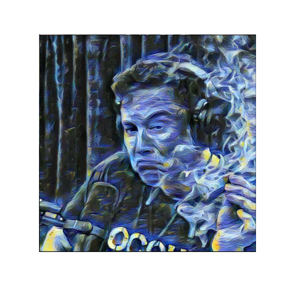
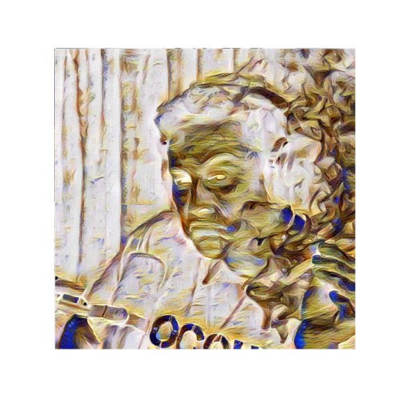
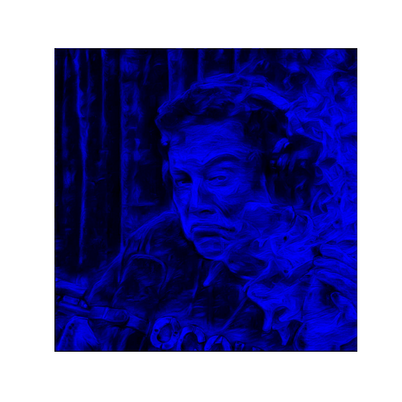
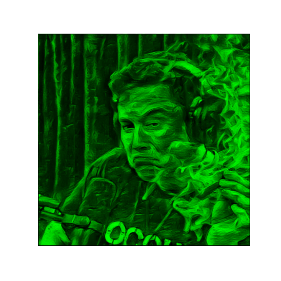
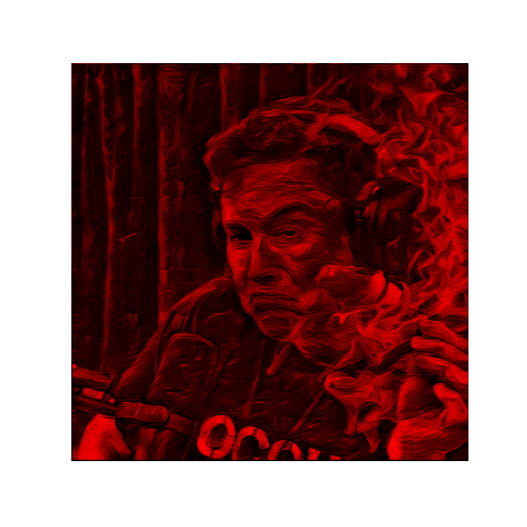
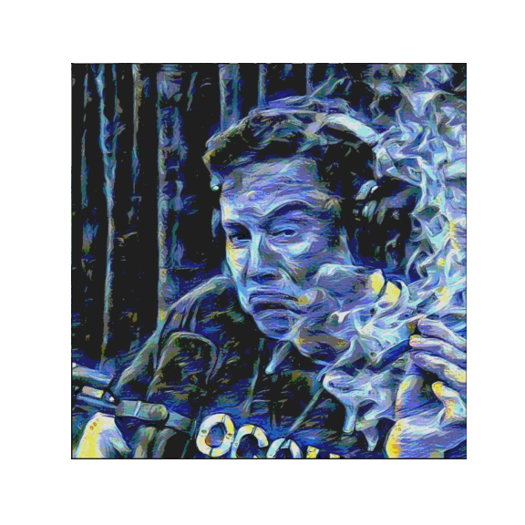

# Exercise 03 - ColorFilter

|                         |                    |
| -----------------------:| ------------------ |
|   Turn-in directory:    |  ex03/              |
|   Files to turn in:     |  ColorFilter.py    |
|   Forbidden functions:  |  See each method   |
|   Notions:              |  Broadcasting      |

## Objective:
Manipulation of loaded image via numpy arrays and broadcasting.

## Instructions:
You have to build a tool that can apply a variety of color filters on images.
For this exercise, the authorized functions and operators are specified for each methods. You are not allowed to use anything else.

Write a class named `ColorFilter` with 6 methods with the following signatures:
```python
def invert(array):
    """
    Inverts the color of the image received as a numpy array.
    Args:
    -----
        array: numpy.ndarray corresponding to the image.
    Return:
    -------
        array: numpy.ndarray corresponding to the transformed image.
        None: otherwise.
    Raises:
    -------
        This function should not raise any Exception.
    """
```
```python
def to_blue(array):
    """
    Applies a blue filter to the image received as a numpy array.
    Args:
    -----
        array: numpy.ndarray corresponding to the image.
    Return:
    -------
        array: numpy.ndarray corresponding to the transformed image.
        None: otherwise.
    Raises:
    -------
        This function should not raise any Exception.
    """
```
```python
def to_green(array):
    """
    Applies a green filter to the image received as a numpy array.
    Args:
    -----
        array: numpy.ndarray corresponding to the image.
    Return:
    -------
        array: numpy.ndarray corresponding to the transformed image.
        None: otherwise.
    Raises:
    -------
        This function should not raise any Exception.
    """
```
```python
def to_red(array):
    """
    Applies a red filter to the image received as a numpy array.
    Args:
    -----
        array: numpy.ndarray corresponding to the image.
    Return:
    -------
        array: numpy.ndarray corresponding to the transformed image.
        None: otherwise.
    Raises:
    -------
        This function should not raise any Exception.
    """
```
```python
def to_celluloid(array):
    """
    Applies a celluloid filter to the image received as a numpy array.
    Celluloid filter must display at least four thresholds of shades.
    Be careful! You are not asked to apply black contour on the object,
    you only have to work on the shades of your images.
    Remarks:
        celluloid filter is also known as cel-shading or toon-shading.
    Args:
    -----
        array: numpy.ndarray corresponding to the image.
    Return:
    -------
        array: numpy.ndarray corresponding to the transformed image.
        None: otherwise.
    Raises:
    -------
        This function should not raise any Exception.
    """
```
```python
def to_grayscale(array, filter, **kwargs):
    """
    Applies a grayscale filter to the image received as a numpy array.
    For filter = 'mean'/'m': performs the mean of RBG channels.
    For filter = 'weight'/'w': performs a weighted mean of RBG channels.
    Args:
    -----
        array: numpy.ndarray corresponding to the image.
        filter: string with accepted values in ['m','mean','w','weight']
        weights: [kwargs] list of 3 floats where the sum equals to 1,
                 corresponding to the weights of each RBG channels.
    Return:
    -------
        array: numpy.ndarray corresponding to the transformed image.
        None: otherwise.
    Raises:
    -------
        This function should not raise any Exception.
    """
```

You have some restrictions on the authorized methods and operators for each filter method in class `ColorFilter`:

* `invert`:
    * Authorized functions: `None`
    * Authorized operator: `+`, `-`
* `to_blue` :
    * Authorized functions: `.zeros`, `.shape`, `.dstack`
    * Authorized operator: `None`
* `to_green`:
    * Authorized functions: `copy,deepcopy`
    * Authorized operator: `*`
* `to_red`:
    * Authorized functions : `.to_green`, `.to_blue`
    * Authorized operator: `-`, `+`
* `to_celluloid(array)`:
    * Authorized functions: `.arange`, `.linspace`
* `to_grayscale`:
    * Authorized functions: `.sum`, `.shape`, `.reshape`, `.broadcast_to`, `.as_type`
    * Authorized operator: `*`, `/`

```python
>>> from ImageProcessor import ImageProcessor
>>> imp = ImageProcessor()
>>> arr = imp.load("../ressources/42AI.png")
Loading image of dimensions 200 x 200
>>> from ColorFilter import ColorFilter
>>> cf = ColorFilter()
>>> cf.invert(arr)
>>>
>>> cf.to_green(arr)
>>>
>>> cf.to_red(arr)
>>>
>>> cf.to_blue(arr)
>>>
>>> cf.to_celluloid(arr)
>>>
>>> cf.to_grayscale(arr, 'm')
>>>
>>> cf.to_grayscale(arr, 'weighted', [0.2, 0.3, 0.5])
>>>
```

## Examples:

{width=400px} {width=400px}

{width=400px} {width=400px}

{width=400px} {width=400px}


