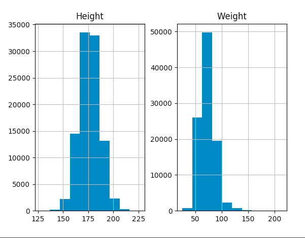
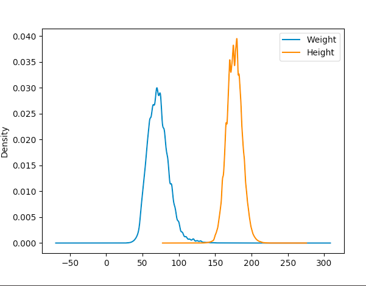
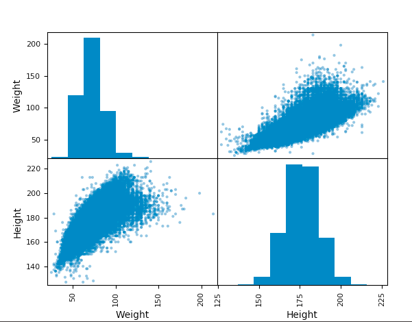
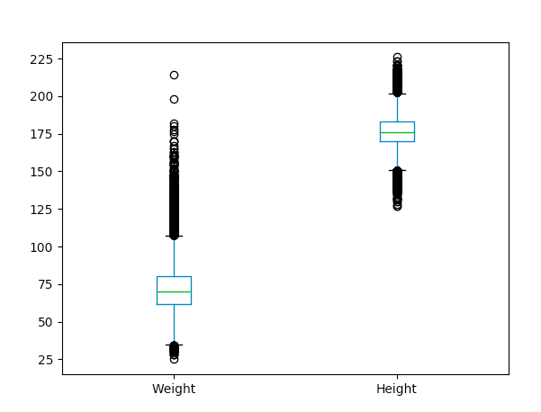

# Exercise 06 - MyPlotLib

|                         |                                       |
| -----------------------:| ------------------------------------- |
|   Turn-in directory:    |  ex06/                                |
|   Files to turn in:     |  MyPlotLib.py                         |
|   Allowed libraries:    |  Pandas, Matplotlib, Seaborn, Scipy   |
|   Remarks:              |  The less work you do, the better!    |
|                         |  You don't necessarily need all those |
|                         |  libraries to complete the exercise.  |

## Objective:
The goal of the exercise is to introduce plotting methods among the different graphical libraries (or graphical modules within libraries) `Pandas`, `Matplotlib`, `Seaborn`, `Scipy` ...

## Instructions:
You will use the dataset: `athlete_events.csv`.

You have to write a class called `MyPlotLib`. This class implements different plotting methods, each taking two arguments:
* a pandas.DataFrame which contains the dataset  
* a list of feature (also called independant variable) names.

Here the list of methods you will implement:
* `histogram(data, features)`: plots one histogram for each numerical feature in the list.
* `density(data, features)`: plots the density curve of each numerical feature in the list.
* `pair_plot(data, features)`: plots a matrix of subplots (also called scatter plot matrix). On each subplot shows a scatter plot of one numerical variable against another one. The main diagonal of this matrix shows simple histograms.
* `box_plot(data, features)`: displays a box plot for each numerical variable in the dataset.

## Examples:

{width=400px} {width=400px}

{width=400px} {width=400px}

